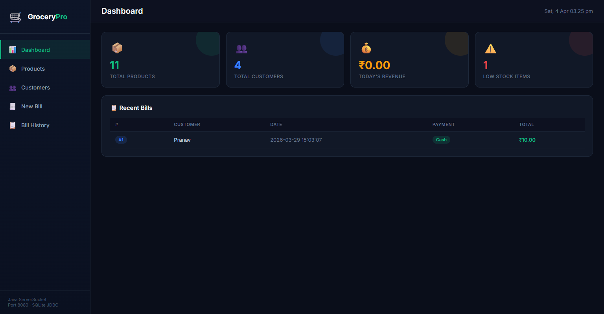
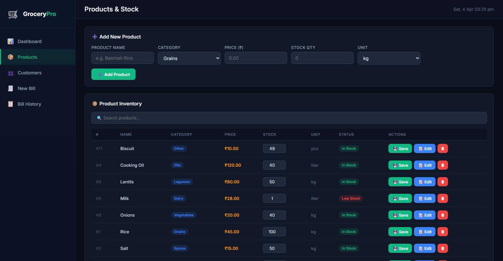
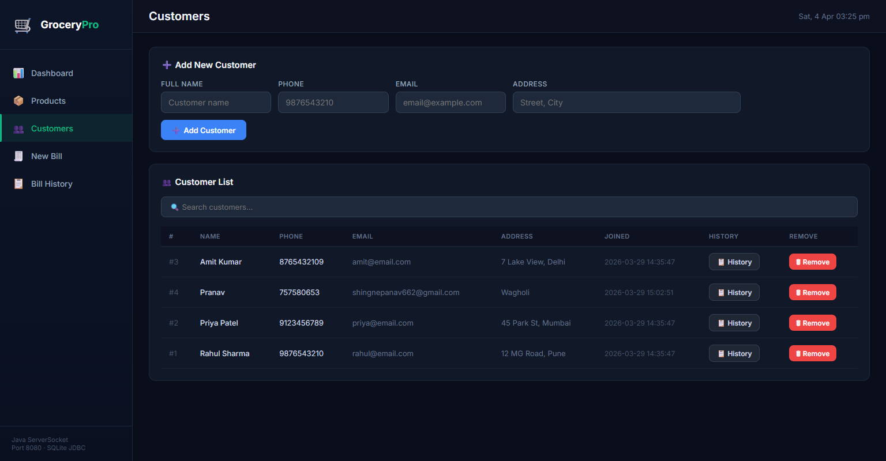
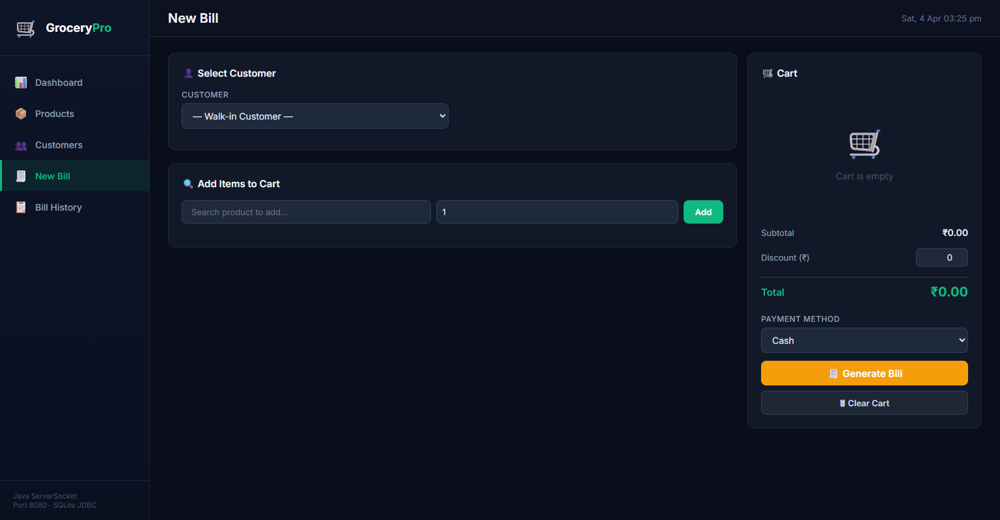
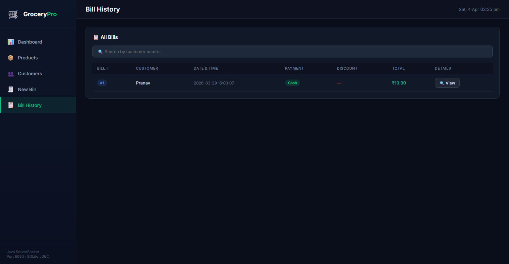

# 🛒 GroceryPro — Store Management System

[](https://www.java.com)
[](https://www.sqlite.org)
[](https://developer.mozilla.org/en-US/docs/Web/Guide/HTML/HTML5)
[](https://developer.mozilla.org/en-US/docs/Web/CSS)
<div align="center">
  
  <br>
  <em>A sleek, glassmorphic dashboard powered entirely by a custom Java HTTP Server</em>
</div>

**GroceryPro** is a high-performance, minimal-dependency Java web application designed for modern store management. Built completely from scratch without heavy web frameworks, it features a custom multi-threaded HTTP server (using standard Sockets), a robust SQLite-backed persistence layer, and a beautiful glassmorphic web dashboard for managing inventory, customers, and dynamic billing.

### 🌐 Live Demo
Access the hosted version on Railway: [**store-management-system-java-production.up.railway.app**](https://store-management-system-java-production.up.railway.app)

---

## 🚀 Key Features

### 📸 Feature Previews

<div align="center">
  <h4>Products & Inventory</h4>
  
  <br><br>
  <h4>Customer Management</h4>
  
  <br><br>
  <h4>Smart Billing</h4>
  
  <br><br>
  <h4>Transactional History</h4>
  
</div>

### 📊 Modern Dashboard
- **Real-time Stats**: Track total products, customers, low stock items, and daily revenue at a glance.
- **Recent Activity**: View the latest transactions in an interactive table.

### 📦 Inventory Management
- **One-Click Updates**: Modify stock quantities directly from the table.
- **Full Product Editing**: A custom modal for editing product names, categories, prices, and units.
- **Low Stock Alerts**: Visual indicators for items that need restocking.

### 👥 Customer Management
- **Detailed Profiles**: Manage customer contact information and purchase history.
- **Transactional History**: View all previous bills associated with a specific customer.

### 🧾 Smart Billing System
- **Quick-Add Items**: Search and add products to the cart instantly.
- **Transactional Integrity**: Uses SQL transactions to ensure stock is updated only when the bill is successfully created.
- **Multiple Payments**: Support for Cash, Card, UPI, and Net Banking.

---

## 🛠️ Technology Stack

| Layer | Technology |
| :--- | :--- |
| **Backend** | Java (Custom HTTP Server via `ServerSocket`) |
| **Database** | SQLite with JDBC Driver |
| **GUI (Desktop)** | Java Swing / AWT Control Panel |
| **Frontend** | Vanilla HTML5, CSS3 (Custom Glassmorphic UI), JavaScript (ES6+) |
| **Concurrency** | Java Multi-threading (`Runnable`, `Thread`) |

---

## 🛠️ Getting Started

### Prerequisites
- **Java JDK 8 or higher** installed on your system.
- **Git** (optional, for cloning).

### Setup & Run
1.  **Clone the Repository**:
    ```bash
    git clone https://github.com/pranav662/Store-Management-System-Java.git
    cd Store-Management-System-Java
    ```
2.  **Launch the Application**:
    Simply double-click `run.bat` or run it from your terminal:
    ```cmd
    run.bat
    ```
    - The terminal will automatically download the required SQLite JDBC driver if it's missing.
    - It will compile `Store.java` and initialize the local database.
    - A **Control Panel** window will open.

3.  **Access the Dashboard**:
    - Click **▶ Start Server** in the Control Panel.
    - Open your browser and go to: `http://localhost:8080`

---

## 📄 License
This project is licensed under the MIT License - see the LICENSE file for details.

---
Built with ❤️ by [Pranav](https://github.com/pranav662)
